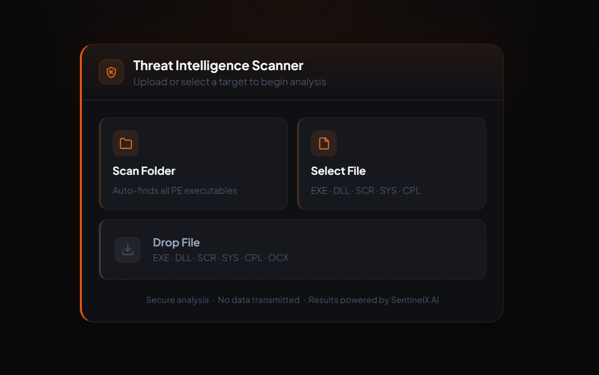

# Rogue Sandbox

```
 ██████╗  ██████╗  ██████╗ ██╗   ██╗███████╗
 ██╔══██╗██╔═══██╗██╔════╝ ██║   ██║██╔════╝
 ██████╔╝██║   ██║██║  ███╗██║   ██║█████╗
 ██╔══██╗██║   ██║██║   ██║██║   ██║██╔══╝
 ██║  ██║╚██████╔╝╚██████╔╝╚██████╔╝███████╗
 ╚═╝  ╚═╝ ╚═════╝  ╚═════╝  ╚═════╝ ╚══════╝
  S A N D B O X
```

> Browser-based PE injection via Chrome's File System Access API.
> Red team tool. No binary drops, no exploits, pure social engineering + API abuse.

---

## What It Does

Rogue Sandbox masquerades as an endpoint security scanner. When a target grants folder access through the browser's native permission dialog, it:

1. Reads PE files from the selected directory
2. Injects operator-supplied shellcode into the executable (new section or code cave)
3. Writes the modified binary back to disk, bypassing Chrome Safe Browsing

The target never installs software or downloads a suspicious file. The browser itself does the work.

---

## Screenshots



---

## Attack Flow

```
Target visits lure URL (Cloudflare tunnel)
    |
    v
"SentinelX Enterprise Protection" landing page
    |
    v
Clicks "Start Deep Scan" -> browser permission dialog
    |
    v
[ALLOW] -> scanner animation plays
    |
    v
PE files read from disk -> shellcode injected
    |
    v
Modified binary written back (bypass strategy depends on browser)
    |
    v
Target EXE now contains operator shellcode
```

---

## Bypass Strategies

The write-back cascade tries each strategy in order until one succeeds:

| Strategy | Browser | Method |
|----------|---------|--------|
| Silent in-place | Edge | Direct write to original .exe via FSA handle |
| Safe extension | Chrome | Write as .json (NOT_DANGEROUS in Chromium SB), show rename instructions |

---

## PE Injection Methods

### New Section (.sntx)
- Appends a new RWX section after the last section
- XOR-encodes shellcode with random single-byte key
- Position-independent decoder stub (49 bytes) runs first
- Restore stub patches original entry point bytes back, then jumps to OEP
- Original program continues execution after shellcode

### Code Cave
- Finds null-byte runs in existing executable sections
- Writes shellcode + trampoline into the cave
- Smaller footprint, no new section header visible
- Falls back to New Section if no suitable cave found

---

## Setup

```bash
git clone https://github.com/danieloz147/rogue-sandbox.git
cd rogue-sandbox
npm install
```

### Run

```bash
# Provide your own raw shellcode binary
SHELLCODE_FILE=shellcode/payload.bin PORT=7654 node server.js

# With VT hash lookups
SHELLCODE_FILE=shellcode/payload.bin \
  VT_API_KEY=your_key \
  INJECT_METHOD=section \
  PORT=443 node server.js
```

### Expose via Cloudflare tunnel

```bash
cloudflared tunnel --url http://localhost:7654 --no-autoupdate
```

---

## Configuration

| Env Variable | Default | Description |
|---|---|---|
| `PORT` | 3000 | Server listen port |
| `SHELLCODE_FILE` | (none) | Path to raw shellcode binary |
| `SHELLCODE_B64` | (none) | Base64-encoded shellcode (alternative to file) |
| `INJECT_METHOD` | section | `section` or `cave` |
| `TARGET_EXE` | (first found) | Specific filename to target |
| `VT_API_KEY` | (none) | VirusTotal API key for hash lookups |

---

## Architecture

```
rogue-sandbox/
  server.js          Express server (config API, VT proxy)
  public/
    index.html       Full SPA (lure UI + PE parser + injection engine)
  shellcode/
    *.bin            Raw shellcode payloads (gitignored, bring your own)
  docs/
    screenshots/     Landing page screenshot
```

All PE parsing and injection happens client-side in the browser. The server only provides:
- Initial shellcode delivery (`/api/config`)
- VT hash proxy (`/api/vt/:hash`)

---

## Browser Compatibility

| Browser | FSA API | Injection | Write-back |
|---------|---------|-----------|------------|
| Chrome 86+ | Yes | Yes | Safe extension bypass (.json) |
| Edge 86+ | Yes | Yes | Silent in-place write |
| Firefox | No | - | - |
| Safari | No | - | - |

---

## OpSec Notes

- Tunnel URLs are ephemeral. Generate a new one per engagement.
- Shellcode binaries are gitignored. Never commit payloads.
- The server binds to `localhost` only. External access is through the tunnel.
- No data exfiltration. The tool modifies local files through the browser API.
- VT lookups are optional and use the operator's key (not exposed to target).
- `X-Robots-Tag: noindex` prevents search engine caching of tunnel URLs.

---

## Disclaimer

This tool is intended for authorized red team engagements and security research only. Unauthorized use against systems you do not have explicit written permission to test is illegal. The authors assume no liability for misuse.
